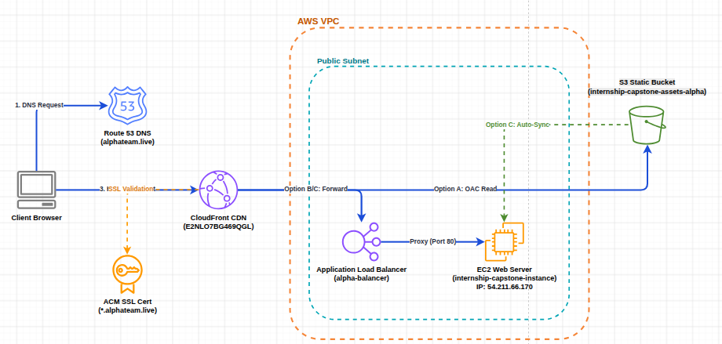

# AlphaPay — African Cross-Border Payments Platform

> **Azubi Africa Internship Programme** — Capstone Project 1: End-to-End Cloud Solution Design & Deployment  
> **Team:** Team Alpha | **Cohort:** 2026 (GEN 5)

---

## Overview

**AlphaPay** is a fintech platform for instant, zero-fee cross-border money transfers across Africa. Users can send money to any bank or mobile money wallet in 15+ African countries in under 2 seconds, generate virtual Visa cards for international payments, and businesses can use the full payments API for bulk payroll and merchant collections.

The platform is built as an interactive static **Astro** Single Page Application (SPA) and designed for deployment across several cloud-native **AWS** infrastructure models.

---

## Architecture

The diagram below outlines the end-to-end cloud infrastructure of AlphaPay. It illustrates Route 53 DNS routing, the CloudFront global CDN distribution, the serverless S3 origin (Option A), the virtual server Nginx hosting via an ALB (Option B), and the hybrid S3-to-EC2 sync method (Option C), along with the automated GitHub Actions CI/CD pipelines.



---

## Live Site

🌐 **[alphapay.teamalpha.live](https://alphapay.teamalpha.live)**

---

## Team Alpha

| Name | Role |
|---|---|
| Mustapha Haadi | Developer (Team Lead) |
| David Yirenkyi | Developer |
| Emmanuel Yelisomah | Developer |
| Daniel Hanson Reynolds | Developer |
| Zakaria Adeeba | Developer |
| Evame Cobblah | Developer |

---

## Tech Stack

### Frontend
- **Astro 7** — Static site generation (SSG) with SPA transitions via `ClientRouter`
- **TailwindCSS v4** — Styling with dark mode support
- **Preline v4** — UI component modules
- **Starlight** — Developer documentation

### Cloud Infrastructure (AWS)
| Service | Purpose |
|---|---|
| **Amazon S3** | Static website hosting (OAC-protected) |
| **Amazon EC2** | Application hosting (Nginx Web Server) |
| **Amazon CloudFront** | Global low-latency Content Delivery Network (CDN) |
| **AWS Certificate Manager (ACM)** | SSL/TLS certificate management |
| **AWS IAM** | Least-privilege role & access control |
| **GitHub Actions** | Automated CI/CD pipelines |

---

## Getting Started (Local Development)

### Prerequisites
- Node.js ≥ 20
- npm ≥ 10

### Install & Run

```bash
# Clone the repository
git clone https://github.com/Azubi-Team-Alpha/end-to-end-cloud-solution-design--alphapay.git
cd end-to-end-cloud-solution-design--alphapay

# Install dependencies
npm install

# Start development server
npm run dev
```

The dev server runs at `http://localhost:4321`.

### Build for Production

```bash
npm run build
```

This runs `astro check` (TypeScript validation), `astro build` (static site generation), and post-processes HTML for optimization.

---

## Environment Variables & CI/CD Secrets

The project utilizes environment variables for local integration/testing and automated CI/CD deployments on AWS (S3 and EC2).

### Local Setup

Copy the example environment file to create your local `.env`:

```bash
cp .env.example .env
```

Configure the local keys in `.env` to match your local SDK credentials and testing environment.

### GitHub Secrets Configuration

To run the automated deployment pipelines successfully, configure the following secrets in your GitHub repository under **Settings → Secrets and variables → Actions**:

#### 1. S3 Deployment Secrets (`deploy-s3.yml`)
These secrets are used to compile the project and upload the built assets to AWS S3, with cache invalidation handled by Amazon CloudFront:

| Secret Name | Description | Required | Default |
|---|---|---|---|
| `AWS_ACCESS_KEY_ID` | Access Key of the IAM deployment user. | **Yes** | - |
| `AWS_SECRET_ACCESS_KEY` | Secret Key of the IAM deployment user. | **Yes** | - |
| `AWS_REGION` | The AWS region where S3 is hosted. | No | `us-east-1` |
| `S3_BUCKET` | The target S3 bucket name. | No | `alphapay-africa-static` |
| `CLOUDFRONT_DISTRIBUTION_ID` | CloudFront Distribution ID for cache invalidation. | No | *Skipped if unset* |

#### 2. EC2 Deployment Secrets (`deploy-ec2.yml`)
These secrets are used to SSH into your EC2 Nginx instance, pull the latest code from GitHub, build the project, and reload the server:

| Secret Name | Description | Required | Default |
|---|---|---|---|
| `EC2_HOST` | The Public IP address or DNS name of your EC2 instance. | **Yes** | - |
| `EC2_USERNAME` | The SSH username to connect to EC2. | No | `ubuntu` |
| `EC2_SSH_KEY` | The contents of your private SSH key (`.pem` file). | **Yes** | - |

---

## Project Structure

```
src/
├── pages/          # Astro pages (landing, services, contact, signin, signup, dashboard)
├── content/        # Markdown/MDX content (products, blog, docs)
├── components/     # Reusable UI component definitions
├── data_files/     # Site-wide constants (pricing, FAQs, features)
├── images/         # Local visual assets
└── layouts/        # MainLayout shell with ClientRouter setup
```

---

## Deployment Options

AlphaPay supports three primary deployment configurations:

*   **Option A: S3 Serverless Hosting (Recommended)** – Cost-effective, serverless, zero-maintenance. Pushed automatically via CI/CD.
*   **Option B: EC2 Virtual Server Hosting** – Self-hosted virtual Linux instance with Nginx server blocks and Let's Encrypt SSL.
*   **Option C: Hybrid EC2 + S3 Sync Hosting** – Files are served from EC2 Nginx but automatically synced/pulled from an S3 bucket source via an IAM Instance Profile.

Detailed step-by-step console instructions, IAM policies, and Nginx setups can be found in the [AWS Deployment Guide](./AWS_DEPLOYMENT.md).

---

## Security Status

| Control | Status |
|---|---|
| HTTPS (ACM SSL) | ✅ Active |
| CloudFront CDN | ✅ Enabled |
| CI/CD Pipeline | ✅ Live |
| IAM Least Privilege | ✅ Applied |
| S3 Origin Access | ✅ OAC Only |

---

## License

MIT — see [LICENSE](./LICENSE)

---
